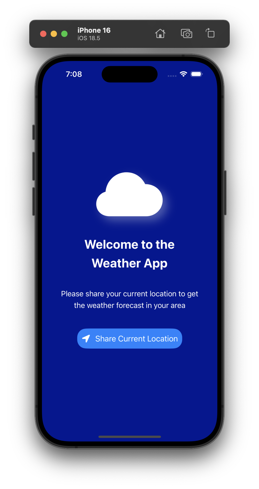
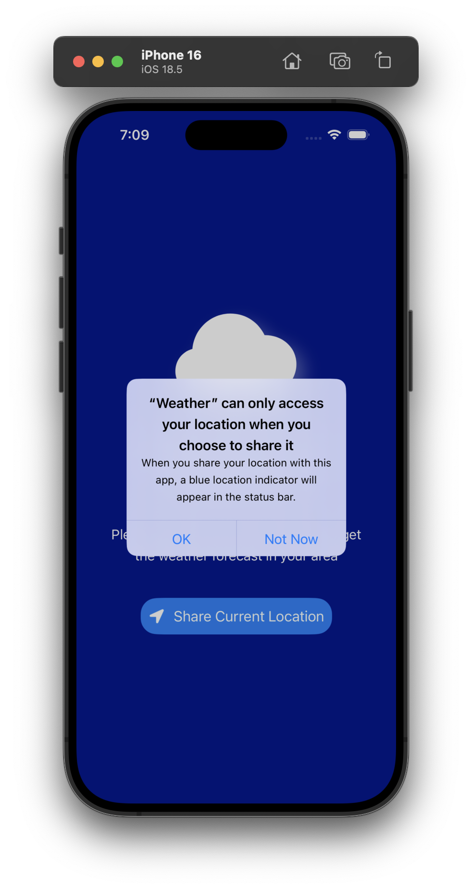
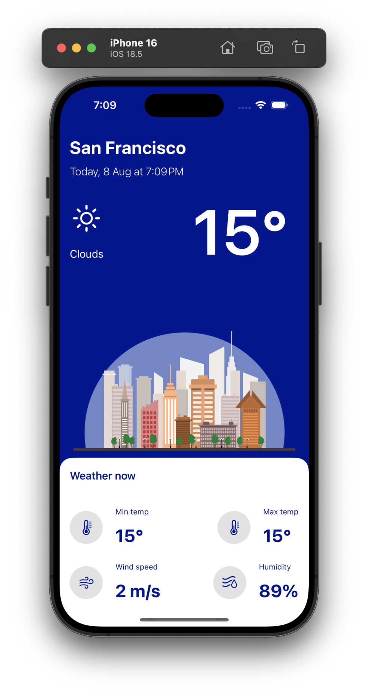

# WeatherApp ☀️🌧️

A beginner-friendly SwiftUI-based iOS app that shows real-time weather information based on the user's current location. This project explores integrating **Core Location** with **SwiftUI**, fetching weather data via a public API, and presenting it through a clean and responsive interface.

---

## 🚀 Features

📍 Fetch Weather Based on Current Location  
🌡️ Display Temperature, Weather Conditions, and Location Name  
📱 Minimal and Clean SwiftUI Layout  
🧭 Location Permissions Handling  
🎨 Weather Icons & Descriptive UI  
🌙 Dark Mode Support  
🧩 Reusable Views and Components  
🧭 MVVM Architecture for Clean Code  

---

## 🧰 Tech Stack

🧑‍💻 Language: Swift  
🖼️ UI Framework: SwiftUI  
📍 Location: Core Location  
🌐 Networking: URLSession / Weather API (e.g., OpenWeatherMap)  
📦 Architecture: MVVM   
💻 IDE: Xcode  
🚀 Deployment Target: iOS 15+

---

## 📸 Screenshots

### Welcome Screen


### Permission


### Current Weather Screen


---

## 📁 Project Structure

```

├── Weather.xcodeproj
|   ├── project.pbxproj
|   ├── project.xcworkspace
|   │   └── contents.xcworkspacedata
|   └── xcuserdata
├── Weather
|   ├── Assets.xcassets
|   ├── Components
|   │   └── WeatherRow.swift
|   ├── Extensions
|   │   ├── Double.swift
|   │   ├── RoundedCorner.swift
|   │   └── View.swift
|   ├── Managers
|   │   ├── LocationManager.swift
|   │   └── WeatherManager.swift
|   ├── Models
|   │   └── ResponseBody.swift
|   ├── PreviewData
|   │   ├── ModelData.swift
|   │   └── weatherData.json
|   └── Views
|   │   ├── ContentView.swift
|   │   ├── LoadingView.swift
|   │   ├── WeatherView.swift
|   │   └── WelcomeView.swift
└── WeatherApp.swift
├── Screenshots
├── README.md

````

---

## 🛠️ Getting Started

### Prerequisites

- Xcode (latest stable version)
- iOS SDK (15+)
- Basic understanding of Swift & SwiftUI

### Installation

```bash
git clone https://github.com/SameerNadaf/Weather-Application.git
cd Weather-Application
open Weather.xcodeproj
````

### Run the App

* Choose a simulator or connect your iPhone
* Press `Cmd + R` to build and run

---

## 📱 Usage

* On launch, allow location access to fetch weather data.
* The app shows the current temperature, location, and weather condition.
* Swipe down or relaunch to refresh weather data.

---

## 🎓 Learning Purpose

This app was built as a practice project to learn:

* Integrating Core Location in SwiftUI
* Using public APIs (like OpenWeatherMap) in iOS
* MVVM architecture for better scalability
* SwiftUI layouts and view separation
* Handling permissions and asynchronous data fetch

---

## 🤝 Contributing

This is an open learning project. Fork it, improve it, or use it as a base for your own weather app!

---

## 🪪 License

**MIT License**.

---

## 📬 Contact & Attribution

Developed by **Sameer Nadaf**
GitHub: [@SameerNadaf](https://github.com/SameerNadaf)
⭐️ Drop a star if this helped you or inspired your own project!

---

## 🙌 Acknowledgments

* [OpenWeatherMap API](https://openweathermap.org/api) for weather data
